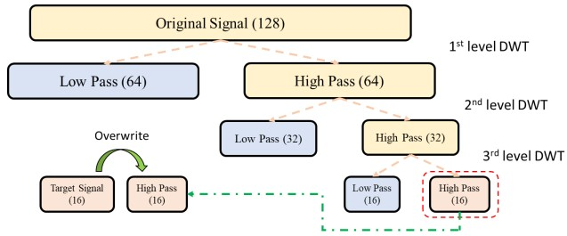
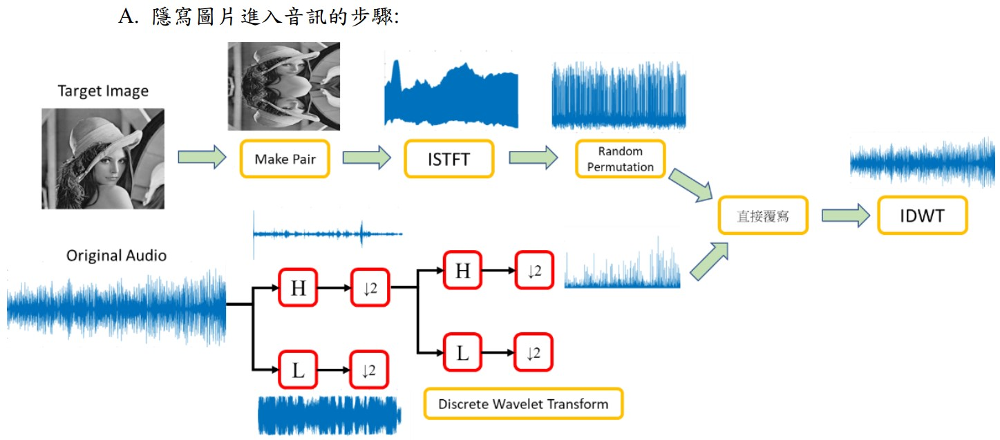
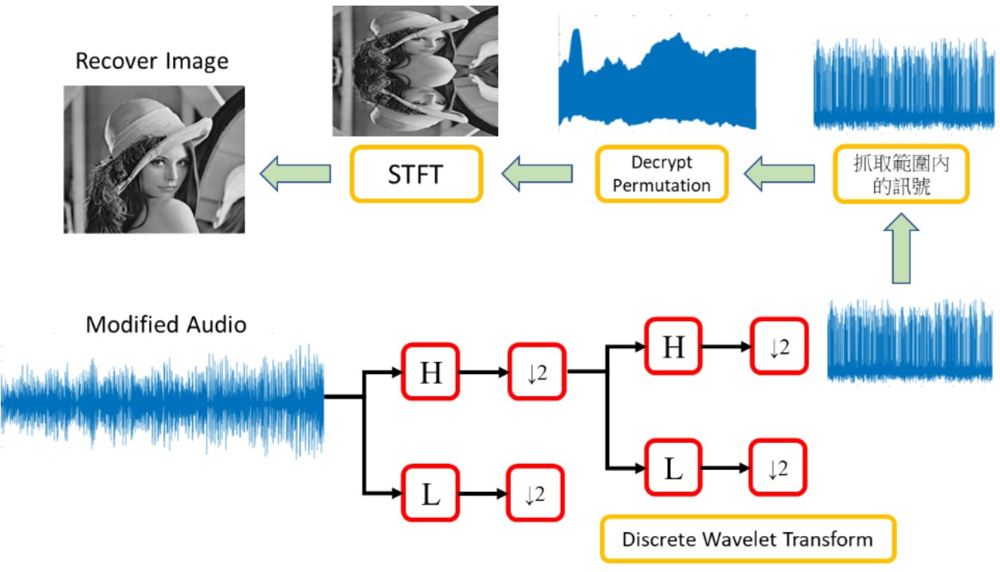
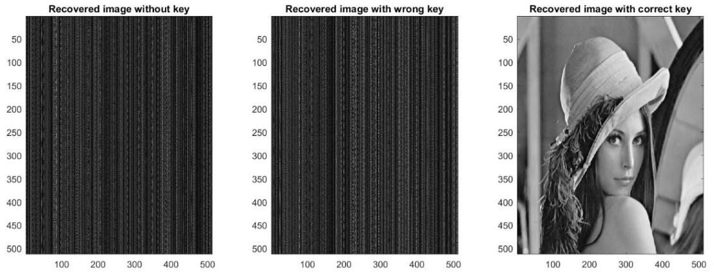
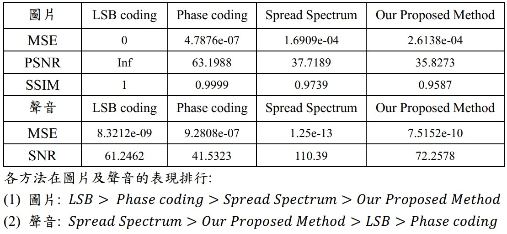

# Image-in-Audio-Steganography

## Project Intro :dart:

Steganography is a common technique to hide the target data in the carrier message within transmission in order to achieve information safety. Compared to some conventional steganography techniques, we comes up with a new method to secretly hide an image in a audio data. Also, we compare our proposed method with some conventional methods (ex: LSB coding, Spread Spectrum coding, Phase coding) both qualitatively and quantitatively. It turns out that our proposed method has overcome several shortcomings in other methods and has a decent effect in recovery.

## Our Proposed Method

In this method, we simply see the target image (the data we want to cover) as an **spectrogram** , then perform `Inverse Short-Time Fourier Transform` on that image to get the corresponding time-domain signal. After that, `Discrete Wavelet Transform` is applied to carrier sound wave to split and retrieve the highest frequency part of it. Then, this particular part would be directly overwritten by the target signal (transformed from target image) and perform `Inverse Discrete Wavelet Transform` to transform back to encrypted time-domain signal. 

Note that both the sender and the receiver share a key, which is a number, will be used as a random seed to generate a sequence of random permutation that will applied on traget signal right before the overwriting procedure.

### Discrete Wavelet Transform

### Encrypting Procedure

### Retrieving Procedure

## Qualitative and Quantitative Results

For more details, please check the [project report](https://github.com/MaxHsu88/Image-in-Audio-Steganography/blob/master/DSP%20Final%20Project%20Report.pdf)

## Software Requirements

* Matlab

## Reference

### Paper:

* [1] An Effective Technique for Hiding Image in Audio. Najiya Thasneem, Renjith V Ravi. IJSR 2013.

* [2] An Improved Technique for Hiding Data in Audio. Huynh Ba Dieu, Nguyen Xuan Huy. IEEE 2014.

* [3] Kriti Saroha, Pradeep Kumar Singh. “A Variant of LSB Steganography for Hiding Images in Audio”. International Journal of Computer Applications. Dec 2010.

* [4] Dalal N. Hmood, Khamael A. Khudhiar, Mohammed S. Altaei. “ A New Steganographic Method for Embedded Image In Audio File.

### Textbooks:

Ingemar J. Cox. “ Digital Watermarking and Steganography”. 2008
